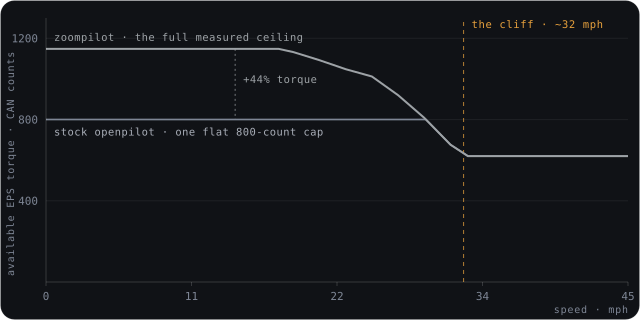

# Steering improvements

zoompilot reverse-engineered the Mazda steering hardware so the electric
power steering (EPS) works to its full potential. The approach is
data-driven: every constant is measured, logged, and validated against
thousands of miles of driving.

## Speed-dependent torque

Stock openpilot uses one lateral acceleration factor for all speeds.
zoompilot encodes the EPS's full torque curve instead. The result is more
confident steering in neighborhoods and fewer wobbles on the highway.

## Speed-dependent tuning

The EPS behaves in a non-linear way across speeds. Instead of one tune,
zoompilot learns across **seven distinct speed ranges** and applies the
right one for your current speed.

Self-tune does the learning in the background. Fresh installs on 2022+
EPS Mazdas start from seeds learned on a real CX-5, so the car steers
well from day one and improves from there.

*One corner demand, held constant. Stock openpilot asks for the same
torque at every speed — short of the wheel in parking lots, pushy on the
highway. zoompilot learns a tune per band and rescales exactly at the
cliff. The two response lines are schematic; the cliff position, the
scale step, and the band boundaries are measured. Numbers:
[Lateral tune](../technical/lateral-tune.md).*

## Rate-matched commands

zoompilot asks for the EPS's maximum of **12 units per frame**, up from
stock openpilot's 10. Torque ramps up faster, so the car reacts to
curves sooner.

## Factory-matched specs

The steering ratio, vehicle mass, wheelbase, and lag are set to Mazda's
real figures, then refined against driving data.

## Steering to zero

On the 2022+ EPS motor, zoompilot steers down to 0 mph. This also
covers older Mazdas fitted with a swapped 2022-25 CX-5 motor, identified
by EPS fingerprinting. See [Supported cars](../getting-started/supported-cars.md).

## Design details

The full evidence and design record lives in the technical section:

- [Mazda lateral: evidence and design notes](../technical/mazda-lateral.md)
- [Lateral tune: v2 torque controller](../technical/lateral-tune.md)
- [v2 torque tune roadmap](../technical/lateral-tune-roadmap.md)
