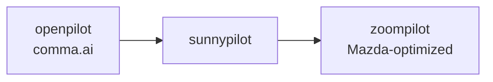

# What is zoompilot?

zoompilot is a [Mazda-optimized fork](https://zoompilot.ai) of
[sunnypilot](https://sunnypilot.ai), which is itself a fork of
[openpilot](https://comma.ai) by comma.ai. It runs on a comma device and
gives Mazda drivers the best openpilot experience the hardware allows.

## Fork lineage

zoompilot stands on sunnypilot, which stands on openpilot. Nearly
everything here rides on their work. See [About & credits](../about.md).

## What zoompilot changes

zoompilot keeps openpilot's safety model and adds Mazda-specific work in
four areas:

1. **Steering** — the full torque curve of the 2022+ EPS, learned across
   seven speed ranges. See [Steering improvements](../features/steering.md).
2. **Cruise** — one unified system owns your set speed: ICBM, Speed-Limit
   Assist, Smart Cruise, and deceleration overshoot. See
   [Radar cruise enhancements](../features/smart-cruise.md).
3. **Sensors** — the forward radar, blind-spot monitors, and speed-limit
   signs are wired into openpilot. See
   [Sensor readouts](../features/sensor-readouts.md).
4. **Alpha longitudinal** — openpilot drives gas and brakes instead of the
   stock radar cruise. Work in progress, with real trade-offs. See
   [Alpha longitudinal](../features/alpha-longitudinal.md).

## Who builds it

zoompilot is a community project. Alex Frutkin
([@yummydirt](https://github.com/yummydirt)) did the reverse engineering
and implementation for alpha longitudinal. Contributors including
[@mzdnick](https://github.com/mzdnick) added VIN and EPS fingerprinting.
The source lives at [github.com/zoompilot/zoompilot](https://github.com/zoompilot/zoompilot).

## Disclaimers

- This is experimental software. You drive the car, follow the law, and
  carry all the risk.
- Mazda, comma.ai, and the sunnypilot project neither endorse zoompilot
  nor have anything to do with it.
- Read the [safety page](../safety.md) before your first drive.
