# Settings

You manage zoompilot from the **Settings** screen on the device. The
panels are: Steering, Cruise, Models, Visuals, Toggles, Device, Software,
and Developer.

This page lists every on-device setting with its accepted values, its
default, and notes for Mazda installs. Values shown here come from the
toggle definitions in the zoompilot source (2026.08 releases).

Each panel below shows its settings screen for both supported
devices, rendered from the release code — comma four strips scroll
sideways; comma 3/3X panels are full-frame. Pick a device once and
every panel follows. The tables stay shared: both devices drive the
same settings, so a row's value means the same thing on each. The
capture checklist and the tool that regenerates these images live in
[assets/settings](../assets/settings/README.md). Prefer cards and
search? The same settings are in the
[Settings explorer](explorer.md).

  <button type="button" data-device="mici" aria-pressed="true">comma four</button>
  <button type="button" data-device="tici" aria-pressed="false">comma 3/3X</button>

!!! note "Offroad only"

    Most control settings can only be changed while the car is parked
    with the ignition off. Settings that change how zoompilot talks to
    the car take effect on the next drive.

## Defaults on a fresh Mazda install

Fresh installs on Mazdas with a 2022-25 CX-5 EPS are not stock
sunnypilot. zoompilot seeds the torque-control stack once, on the first
start:

| Setting | Seeded value |
| --- | --- |
| Enforce Torque Lateral Control | On |
| Self-Tune | On |
| Speed-Dependent Self-Tune | On |
| Torque Control Tune Version | v2.0 |

The seed runs only once, on cars with the steer-to-zero EPS (the 2022+
CX-5 motor, the CX-9, and EPS swaps). After it runs, you can turn any of
these off and zoompilot keeps your choice. Everything else starts at the
defaults in the tables below.

A factory reset clears all settings back to these values. See
[Install](../getting-started/install.md).

## Steering

<figure class="settings-strip settings-figure-mici">
  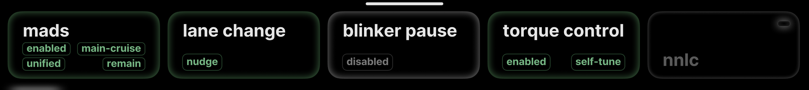
  <figcaption>comma four</figcaption>
</figure>
<figure class="settings-shot settings-figure-tici">
  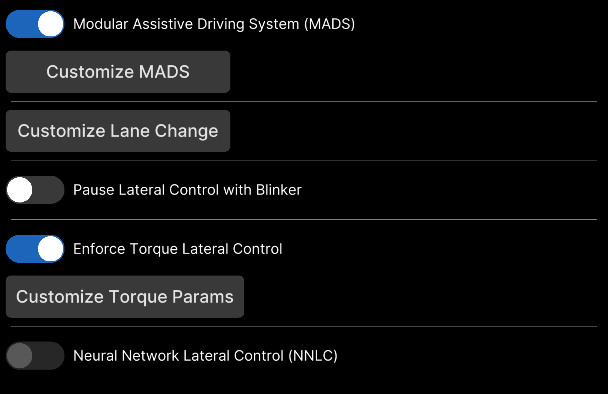
  <figcaption>comma 3/3X</figcaption>
</figure>

Steering settings control lateral (steering) behavior: MADS, lane
changes, and torque tuning. Some of these settings are covered in more
depth on [Steering improvements](../features/steering.md).

| Setting | Values | Default | Notes |
| --- | --- | --- | --- |
| Enable Modular Assistive Driving System (MADS) | On / Off | **On** | Lets steering stay active without cruise engaged. Off reverts to stock engagement rules. |
| Toggle with Main Cruise | On / Off | **On** | MADS sub-panel. |
| Unified Engagement Mode (UEM) | On / Off | **On** | MADS sub-panel. One pedal action engages steering and cruise together. |
| Steering Mode on Brake Pedal | Remain Active / Pause / Disengage | Remain Active | MADS sub-panel. What steering does when you press the brake pedal. |
| Pause Lateral Control with Blinker | On / Off | Off | Pauses steering below a speed while the blinker is on. |
| Minimum Speed to Pause Lateral Control | 0–255, step 5 | 20 | km/h or mph. Needs the toggle above. |
| Post-Blinker Delay | 0–10 s, step 1 | 0 s | Wait time before steering resumes after the blinker ends. |
| Enforce Torque Lateral Control | On / Off | Off (**On** on Mazda) | Forces the torque steering controller. Hidden on angle-steering cars. Conflicts with NNLC. Seeded on for steer-to-zero Mazdas. |
| Lateral Jerk Torque Controller | On / Off | Off | Smoother wheel movement in theory. Tested on Mazdas: no gain, and it hurt performance. **Leave it off.** |
| Self-Tune | On / Off | Off (**On** on Mazda) | Learns your motor's torque values as you drive. |
| Less Restrict Settings for Self-Tune (Beta) | On / Off | Off | More forgiving learning. Needs Self-Tune. |
| Speed-Dependent Self-Tune (Beta) | On / Off | Off (**On** on Mazda) | Learns separate values across speed bins. See [Steering improvements](../features/steering.md). Needs Self-Tune. |
| Enable Custom Tuning | On / Off | Off | Manual lateral acceleration factor and friction, instead of the offline data. **Recommended off.** See [Custom tune](../how-to/custom-tune.md). |
| Manual Real-Time Tuning | On / Off | Off | Forces your fixed values live, over self-tune. Needs Enable Custom Tuning. |
| Lateral Acceleration Factor | 0.1–5.0 m/s², step 0.1 | 2.5 | Needs Enable Custom Tuning. |
| Friction | 0.0–1.0, step 0.01 | 0.1 | Needs Enable Custom Tuning. |
| Torque Control Tune Version | v0.0 / v1.0 / v2.0 | v0.0 (**v2.0** on Mazda) | Mazda steer-to-zero cars are seeded with [v2.0](../technical/lateral-tune.md). |
| Auto Lane Change by Blinker | Off / Nudge / Nudgeless / 0.5 / 1 / 2 / 3 s | Nudge | Blinker-only lane changes after a delay. Caution: only signal when traffic allows. |
| Block Lane Change: Road Edge Detection | On / Off | Off | Blocks a lane change when the model sees a road edge on that side. |
| Lane Change Smoothing | Off / Fast / Medium / Slow / Extra Slow | Off | Slows the lane change down. Off is stock. |
| Auto Lane Change: Delay with Blind Spot | On / Off | Off | Waits when BSM sees a car. Needs BSM and a lane change timer above. |
| Neural Network Lateral Control (NNLC) | On / Off | Off | Neural-network steering. Models exist for the CX-5 2022 and CX-9, but zoompilot's tuned torque control is the tested path on Mazda. Conflicts with Enforce Torque and the jerk controller. See [Models](#models). |

## Cruise

<figure class="settings-strip settings-figure-mici">
  
  <figcaption>comma four</figcaption>
</figure>
<figure class="settings-shot settings-figure-tici">
  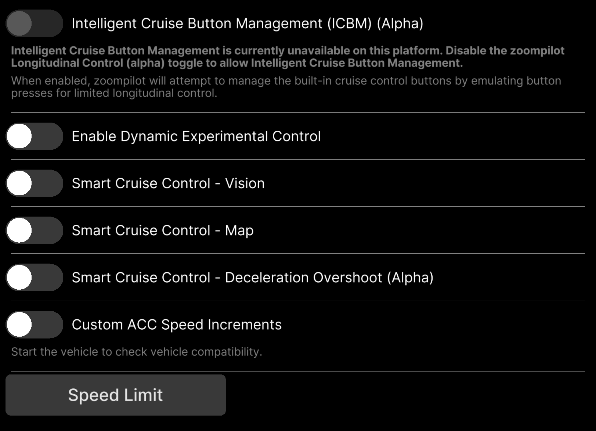
  <figcaption>comma 3/3X</figcaption>
</figure>

Cruise settings control speed and distance behavior. See
[Smart cruise](../features/smart-cruise.md) and
[ICBM](../features/icbm.md) for the features behind these settings.

| Setting | Values | Default | Notes |
| --- | --- | --- | --- |
| Experimental Mode | On / Off | Off | End-to-end driving behavior. Shown when zoompilot controls gas and brakes (alpha longitudinal on Mazda). |
| Dynamic Experimental Control | On / Off | Off | The model picks between ACC and end-to-end per moment. Needs longitudinal control. |
| Disengage Cruise on Accelerator Pedal | On / Off | Off | When off, the gas pedal overrides without canceling. |
| Driving Personality | Aggressive / Standard / Relaxed | Standard | Follow distance and gas/brake style. You can cycle it with the distance button on some cars. |
| Intelligent Cruise Button Management (ICBM) (Alpha) | On / Off | Off | zoompilot presses your cruise buttons for you. Every Mazda supports it; see [ICBM](../features/icbm.md). |
| Enable Custom ACC Speed Intervals | On / Off | Off | Custom step sizes for your cruise buttons. Available through ICBM or longitudinal control. |
| Short Press Increment | 1–10 | 1 | km/h or mph per short press. |
| Long Press Increment | 1–10 | 5 | Step size while holding. |
| Speed Limit Assist Mode | Off / Information / Warning / Assist | Information | See [Speed-Limit Assist](../features/speed-limit-assist.md). Assist changes the set speed; it needs ICBM or longitudinal control. |
| Speed Limit Source | Car State Only / Map Data Only / Car State Priority / Map Data Priority / Combined | Map Data Priority | Nav SD card gives map data. |
| Speed Limit Offset Type | Off / Fixed / Percentage | Off | How the offset is applied. |
| Speed Limit Offset Value | −30 to +30, step 1 | 0 | km/h or mph. Needs an offset type above. |
| Smart Cruise Control: Vision | On / Off | Off | Slows for curves read from the cameras. |
| Smart Cruise Control: Map | On / Off | Off | Slows for curves read from map data. Needs the nav SD card. |
| Deceleration Overshoot (Alpha) | On / Off | Off | Mazda-only. Asks for more deceleration than the model wants, because the Mazda ECU is slow to slow down. See [Deceleration Overshoot](../features/deceleration-overshoot.md). |

## Models

<figure class="settings-strip settings-figure-mici">
  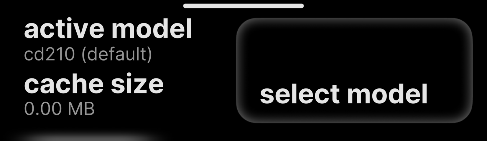
  <figcaption>comma four</figcaption>
</figure>
<figure class="settings-shot settings-figure-tici">
  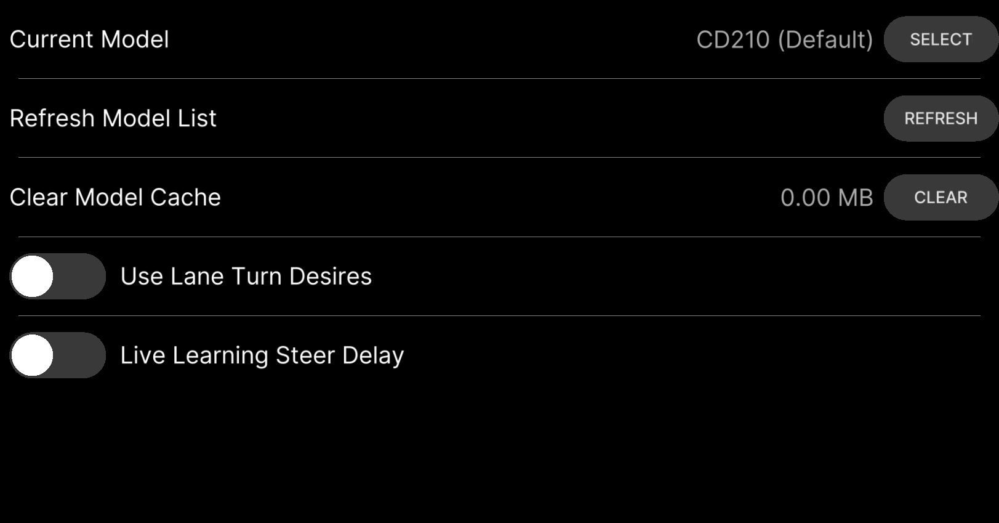
  <figcaption>comma 3/3X</figcaption>
</figure>

Model behavior settings: steering delay, turn speeds, and camera offset.

| Setting | Values | Default | Notes |
| --- | --- | --- | --- |
| Use Lane Turn Desires | On / Off | Off | Plans a turn toward your blinker at low speed, so the car does not pick the wrong turn at a light. |
| Adjust Lane Turn Speed | 0–20, step 1 | 19 | km/h or mph cap for turn desires. Needs the toggle above and Show Advanced Controls. |
| Live Learning Steer Delay | On / Off | **On** | The device learns your car's steering response delay. |
| Adjust Software Delay | 0.05–0.5 s, step 0.01 | 0.2 | Fixed delay when Live Learning is off. Needs Show Advanced Controls. |
| Neural Network Lateral Control (NNLC) | On / Off | Off | Same setting as in the Steering panel. |
| Adjust Camera Offset | −0.35 to +0.35 m, step 0.01 | 0 | Shifts the model's view. Positive moves it left. Needs Show Advanced Controls. |

## Visuals

<figure class="settings-strip settings-figure-mici">
  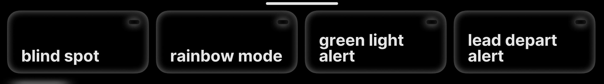
  <figcaption>comma four</figcaption>
</figure>
<figure class="settings-shot settings-figure-tici">
  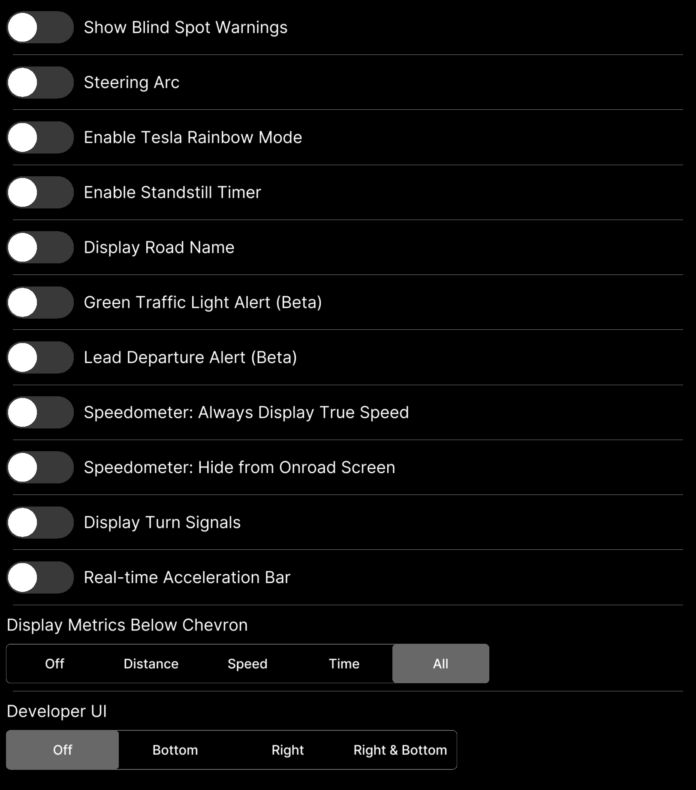
  <figcaption>comma 3/3X</figcaption>
</figure>

Display-only settings. None of them change how the car drives.

| Setting | Values | Default | Notes |
| --- | --- | --- | --- |
| Show Blind Spot Warnings | On / Off | Off | Needs a car with blind spot monitoring. |
| Steering Arc | On / Off | Off | Draws the steering arc on the driving screen. |
| Display Turn Signals | On / Off | Off | Draws turn indicators on the HUD. |
| Display Road Name | On / Off | Off | Needs OpenStreetMap data for your area. |
| Standstill Timer | On / Off | Off | Shows a timer when stopped. |
| Real-time Acceleration Bar | On / Off | Off | Shows what the car is doing right now. |
| Display Metrics Below Chevron | Off / Distance / Speed / Time / All | All | Needs longitudinal control to show. |
| Developer UI | Off / Bottom / Right / Right & Bottom | Off | Real-time debug values. |
| Speedometer: Always Display True Speed | On / Off | Off | Wheel-speed-based speed on supported cars. |
| Speedometer: Hide from Onroad Screen | On / Off | Off | Hides the speedometer. |
| Green Traffic Light Alert (Beta) | On / Off | Off | Chime when your light turns green. A notification only — you still watch the road. |
| Lead Departure Alert (Beta) | On / Off | Off | Chime when the car ahead moves. |
| Tesla Rainbow Mode | On / Off | Off | Cosmetic path colors. |

## Toggles

<figure class="settings-strip settings-figure-mici">
  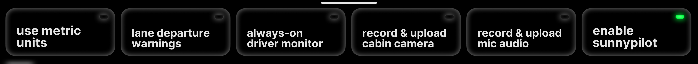
  <figcaption>comma four</figcaption>
</figure>
<figure class="settings-shot settings-figure-tici">
  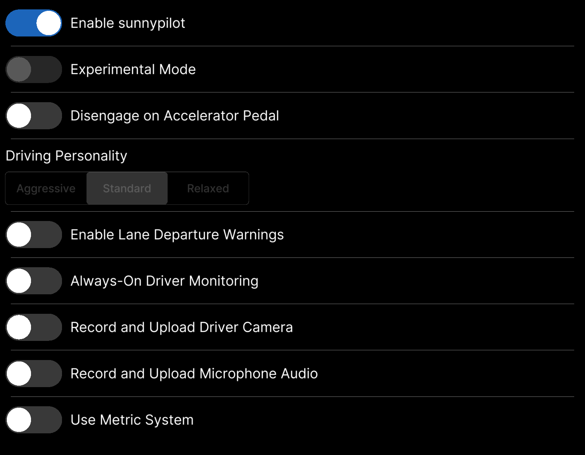
  <figcaption>comma 3/3X</figcaption>
</figure>

Core on/off switches.

| Setting | Values | Default | Notes |
| --- | --- | --- | --- |
| Enable zoompilot | On / Off | **On** | Master switch for driving support. Some screens still label this "Enable sunnypilot"; it is the same toggle. On comma 3/3X the alpha longitudinal toggle likewise reads "sunnypilot Longitudinal Control (Alpha)". |
| Enable Lane Departure Warnings | On / Off | Off | Alerts when you drift over a lane line above 50 km/h (31 mph). |
| Always-On Driver Monitoring | On / Off | Off | Runs driver monitoring even when zoompilot is not engaged. |
| Use Metric System | On / Off | Off | km/h instead of mph. |
| Record and Upload Driver Camera | On / Off | Off | Helps improve driver monitoring. Takes effect next drive. |
| Record and Upload Microphone Audio | On / Off | Off | Audio in dashcam clips. Takes effect next drive. |

## Device

<figure class="settings-strip settings-figure-mici">
  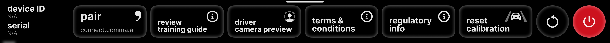
  <figcaption>comma four</figcaption>
</figure>
<figure class="settings-shot settings-figure-tici">
  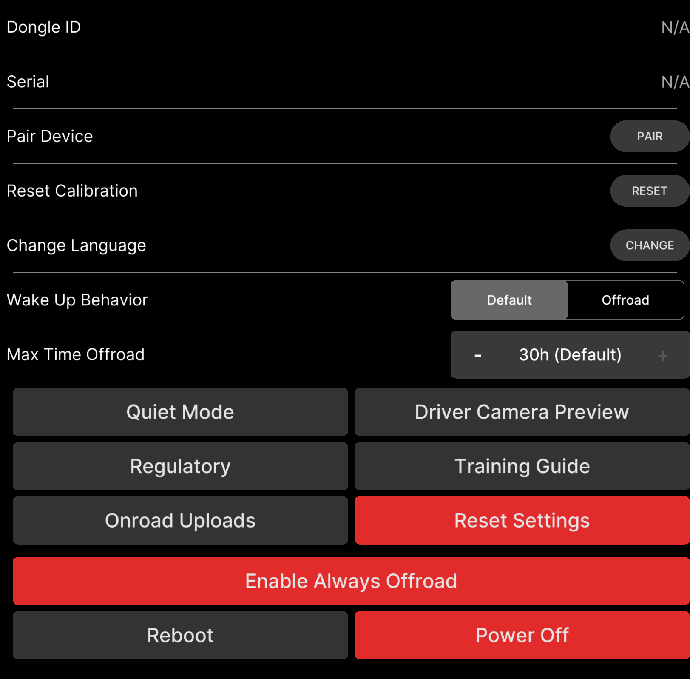
  <figcaption>comma 3/3X</figcaption>
</figure>

Device behavior. See [Your comma device](../how-to/connect-to-comma.md)
for the hardware basics.

| Setting | Values | Default | Notes |
| --- | --- | --- | --- |
| Force Offroad Mode | On / Off | Off | Keeps the device offroad. On Mazda with alpha longitudinal, zoompilot waits until you are parked, then hands the radar back before it grants this. |
| Wake Up Behavior | Standard / Always Offroad | Standard | What the device does after boot or sleep. |
| Quiet Mode | On / Off | Off | Fewer sounds. |
| Onroad Uploads | On / Off | **On** | Upload route logs while driving. |
| Max Time Offroad | Always On, 5 m – 30 h | 30 h | Auto shutdown after the engine goes off. |
| Language | — | English | Device language. |

## Software

<figure class="settings-strip settings-figure-mici">
  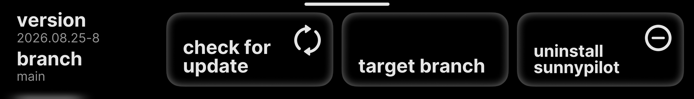
  <figcaption>comma four</figcaption>
</figure>
<figure class="settings-shot settings-figure-tici">
  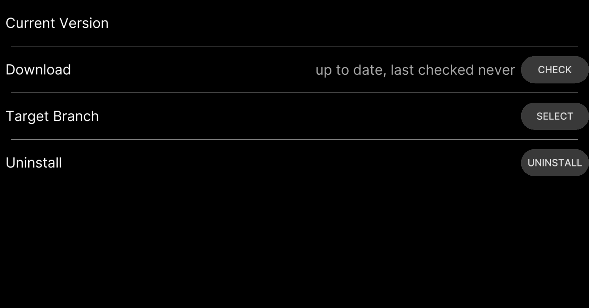
  <figcaption>comma 3/3X</figcaption>
</figure>

| Setting | Values | Default | Notes |
| --- | --- | --- | --- |
| Disable Updates | On / Off | Off | Stops over-the-air updates. Hidden until Show Advanced Controls is on. Keep updates on to get releases. |

## Developer

<figure class="settings-strip settings-figure-mici">
  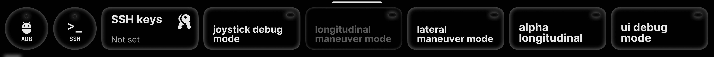
  <figcaption>comma four</figcaption>
</figure>
<figure class="settings-shot settings-figure-tici">
  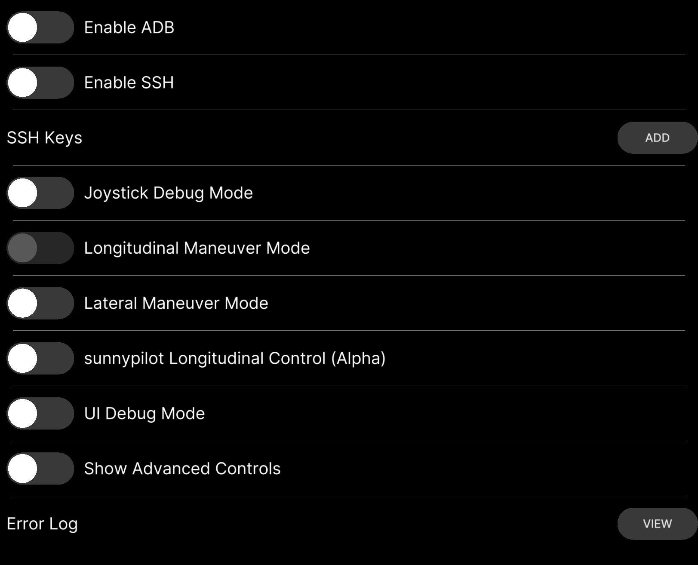
  <figcaption>comma 3/3X</figcaption>
</figure>

Power-user and debug settings. Test-only items are **not for road use**.

| Setting | Values | Default | Notes |
| --- | --- | --- | --- |
| Enable ADB | On / Off | Off | Debug bridge over USB or network. |
| Enable SSH | On / Off | Off | Shell access. SSH keys load from a GitHub username. See [Connect to your comma](../how-to/connect-to-comma.md). |
| Joystick Debug Mode | On / Off | Off | Drives the car from a virtual joystick. Test benches only. |
| Alpha Longitudinal | On / Off | Off | zoompilot controls gas and brakes. **Turns the stock radar, AEB, and FCW off.** Confirm page warns before enabling. The change applies at standstill after a radar hand-back, and zoompilot restarts. See [Alpha longitudinal](../features/alpha-longitudinal.md). |
| UI Debug Mode | On / Off | Off | Shows touch and FPS overlays. |
| [TEST] Lateral Maneuver Mode | On / Off | Off | Deterministic steering test sequence. Not for road use. |
| [TEST] Longitudinal Maneuver Mode | On / Off | Off | Deterministic speed test sequence. Not for road use. |
| Show Advanced Controls | On / Off | Off | Reveals advanced and debug settings across panels. |
| GitHub Runner Service | On / Off | Off | For zoompilot development builds. |
| copyparty Service | On / Off | Off | Browse and download your routes from a browser on your network. Needs Show Advanced Controls. |
| Quickboot Mode | On / Off | Off | Faster boot. Needs updates disabled and Show Advanced Controls. |

## Other panels

Network, Sunnylink, Trips, and Firehose panels manage connectivity and
data collection. None of them change driving behavior, and the defaults
are fine for Mazda owners.

## Where the defaults come from

Mazda seeding is one-time, per install, and gated on the steer-to-zero
EPS flag. The full list of stored settings and their declared defaults
lives in the repo, in
[`common/params_keys.h`](https://github.com/zoompilot/zoompilot/blob/develop/openpilot/common/params_keys.h),
and the settings screen definitions in
[`settings_ui.json`](https://github.com/zoompilot/zoompilot/blob/develop/openpilot/sunnypilot/sunnylink/settings_ui.json).
